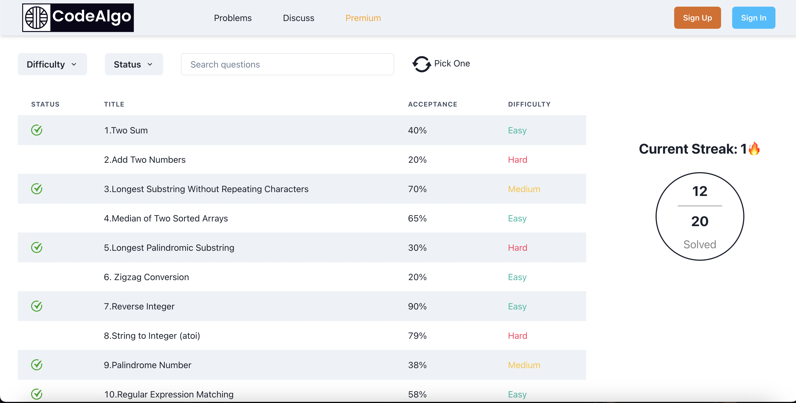
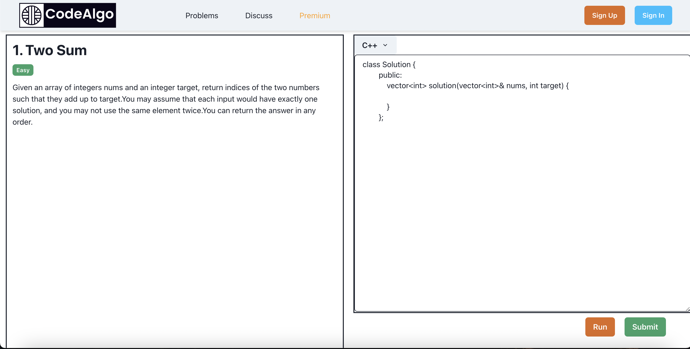
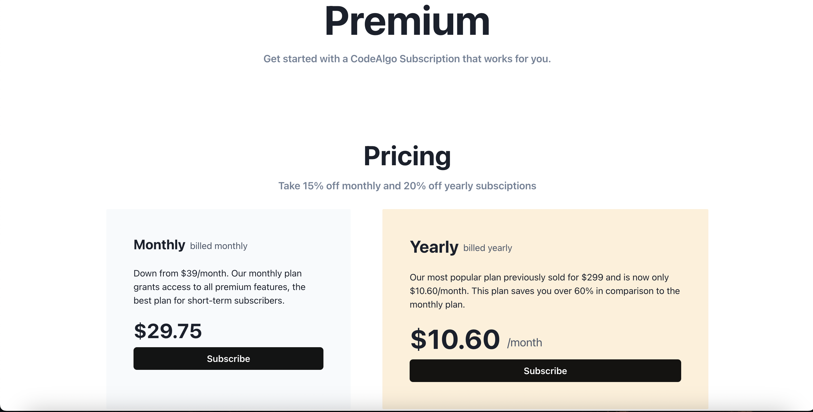
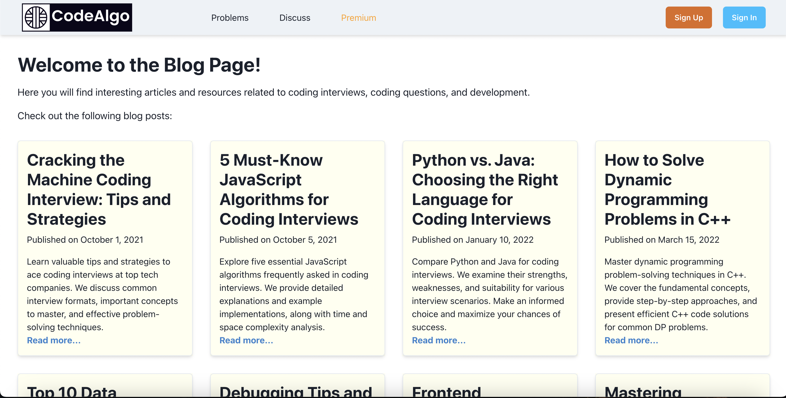

# CodeAlgo

CodeAlgo is an an online algorithmic problem-solving platform. Users can access a list of problems, and write their code in preferred programming language and submit them.

## Demo

Live Link : https://codealgo.netlify.app/

## Features

- Auth and login Functionality
- Search Functionality
- Sorting based on status(solved & unsolved) and difficulty
- Random Question picker
- Pagination
- Compile and Submit your code in any one of 6 language listed 
- Boiler plate code renders when a particular language is chosen

## Screenshots

## Tech Stack

**Client:** React, Chakra UI

**Server:** Node, Express , MongoDB

